# [📈 Live Status](https://demo.upptime.js.org): <!--live status--> **🟧 Partial outage**

This repository contains the open-source uptime monitor and status page for [Jeric Guillermo](uptodatewebdesign.be), powered by [Upptime](https://github.com/upptime/upptime).

With [Upptime](https://upptime.js.org), you can get your own unlimited and free uptime monitor and status page, powered entirely by a GitHub repository. We use [Issues](https://github.com/jgui1129/UTD-Sites-Status-Checker/issues) as incident reports, [Actions](https://github.com/jgui1129/UTD-Sites-Status-Checker/actions) as uptime monitors, and [Pages](https://demo.upptime.js.org) for the status page.

<!--start: status pages-->
<!-- This summary is generated by Upptime (https://github.com/upptime/upptime) -->
<!-- Do not edit this manually, your changes will be overwritten -->
<!-- prettier-ignore -->
| URL | Status | History | Response Time | Uptime |
| --- | ------ | ------- | ------------- | ------ |
|  [Boetiek Shanna](https://www.boetiekshanna.be) | 🟩 Up | [boetiek-shanna.yml](https://github.com/jgui1129/UTD-Sites-Status-Checker/commits/HEAD/history/boetiek-shanna.yml) | 

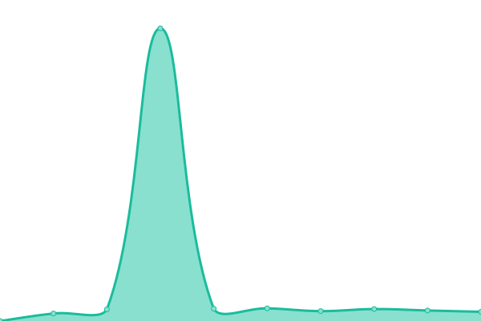 553ms
     
 | 

<a href="https://jgui1129.github.io/UTD-Sites-Status-Checker/history/boetiek-shanna">100.00%</a>
    

|  [A-chief](https://www.a-chief.be) | 🟩 Up | [a-chief.yml](https://github.com/jgui1129/UTD-Sites-Status-Checker/commits/HEAD/history/a-chief.yml) | 

 545ms
     
 | 

<a href="https://jgui1129.github.io/UTD-Sites-Status-Checker/history/a-chief">100.00%</a>
    

|  [AB-Matic](https://www.ab-matic.be) | 🟩 Up | [ab-matic.yml](https://github.com/jgui1129/UTD-Sites-Status-Checker/commits/HEAD/history/ab-matic.yml) | 

 393ms
     
 | 

<a href="https://jgui1129.github.io/UTD-Sites-Status-Checker/history/ab-matic">100.00%</a>
    

|  [AB-Matic Professionals](https://www.ab-matic-professionals.be) | 🟩 Up | [ab-matic-professionals.yml](https://github.com/jgui1129/UTD-Sites-Status-Checker/commits/HEAD/history/ab-matic-professionals.yml) | 

 514ms
     
 | 

<a href="https://jgui1129.github.io/UTD-Sites-Status-Checker/history/ab-matic-professionals">100.00%</a>
    

|  [AB-Matic Solutions](https://www.ab-matic-solutions.be) | 🟩 Up | [ab-matic-solutions.yml](https://github.com/jgui1129/UTD-Sites-Status-Checker/commits/HEAD/history/ab-matic-solutions.yml) | 

 546ms
     
 | 

<a href="https://jgui1129.github.io/UTD-Sites-Status-Checker/history/ab-matic-solutions">100.00%</a>
    

|  [ACR](https://www.acr-tooling.be) | 🟩 Up | [acr.yml](https://github.com/jgui1129/UTD-Sites-Status-Checker/commits/HEAD/history/acr.yml) | 

 469ms
     
 | 

<a href="https://jgui1129.github.io/UTD-Sites-Status-Checker/history/acr">100.00%</a>
    

|  [Acryplex](https://www.acryplex.com) | 🟩 Up | [acryplex.yml](https://github.com/jgui1129/UTD-Sites-Status-Checker/commits/HEAD/history/acryplex.yml) | 

 359ms
     
 | 

<a href="https://jgui1129.github.io/UTD-Sites-Status-Checker/history/acryplex">100.00%</a>
    

|  [Action Valley](https://www.actionvalley.be) | 🟩 Up | [action-valley.yml](https://github.com/jgui1129/UTD-Sites-Status-Checker/commits/HEAD/history/action-valley.yml) | 

 366ms
     
 | 

<a href="https://jgui1129.github.io/UTD-Sites-Status-Checker/history/action-valley">100.00%</a>
    

|  [Adelante Arbeid](https://arbeid.adelante-zorggroep.nl) | 🟩 Up | [adelante-arbeid.yml](https://github.com/jgui1129/UTD-Sites-Status-Checker/commits/HEAD/history/adelante-arbeid.yml) | 

 514ms
     
 | 

<a href="https://jgui1129.github.io/UTD-Sites-Status-Checker/history/adelante-arbeid">100.00%</a>
    

|  [Aelbrecht Maes](https://blog.aelbrechtmaes.be) | 🟩 Up | [aelbrecht-maes.yml](https://github.com/jgui1129/UTD-Sites-Status-Checker/commits/HEAD/history/aelbrecht-maes.yml) | 

 570ms
     
 | 

<a href="https://jgui1129.github.io/UTD-Sites-Status-Checker/history/aelbrecht-maes">100.00%</a>
    

|  [Agin Timmermans](https://www.agintimmermans.nl) | 🟩 Up | [agin-timmermans.yml](https://github.com/jgui1129/UTD-Sites-Status-Checker/commits/HEAD/history/agin-timmermans.yml) | 

 438ms
     
 | 

<a href="https://jgui1129.github.io/UTD-Sites-Status-Checker/history/agin-timmermans">100.00%</a>
    

|  [Alarmsystemen Bergoens](https://www.alarmsystemenbergoens.be) | 🟩 Up | [alarmsystemen-bergoens.yml](https://github.com/jgui1129/UTD-Sites-Status-Checker/commits/HEAD/history/alarmsystemen-bergoens.yml) | 

 458ms
     
 | 

<a href="https://jgui1129.github.io/UTD-Sites-Status-Checker/history/alarmsystemen-bergoens">100.00%</a>
    

|  [Ale Lift Engineering](https://www.alelift.be) | 🟩 Up | [ale-lift-engineering.yml](https://github.com/jgui1129/UTD-Sites-Status-Checker/commits/HEAD/history/ale-lift-engineering.yml) | 

 526ms
     
 | 

<a href="https://jgui1129.github.io/UTD-Sites-Status-Checker/history/ale-lift-engineering">100.00%</a>
    

|  [Alelek](https://www.groepalelek.be) | 🟩 Up | [alelek.yml](https://github.com/jgui1129/UTD-Sites-Status-Checker/commits/HEAD/history/alelek.yml) | 

 394ms
     
 | 

<a href="https://jgui1129.github.io/UTD-Sites-Status-Checker/history/alelek">100.00%</a>
    

|  [All Bikes Wim](https://www.allbikeswim.be) | 🟩 Up | [all-bikes-wim.yml](https://github.com/jgui1129/UTD-Sites-Status-Checker/commits/HEAD/history/all-bikes-wim.yml) | 

 501ms
     
 | 

<a href="https://jgui1129.github.io/UTD-Sites-Status-Checker/history/all-bikes-wim">100.00%</a>
    

|  [Altez](https://blog.altez.eu) | 🟩 Up | [altez.yml](https://github.com/jgui1129/UTD-Sites-Status-Checker/commits/HEAD/history/altez.yml) | 

 514ms
     
 | 

<a href="https://jgui1129.github.io/UTD-Sites-Status-Checker/history/altez">100.00%</a>
    

|  [Apotheek Farmapunt Achel](https://blog.farmapuntachel.be) | 🟩 Up | [apotheek-farmapunt-achel.yml](https://github.com/jgui1129/UTD-Sites-Status-Checker/commits/HEAD/history/apotheek-farmapunt-achel.yml) | 

 489ms
     
 | 

<a href="https://jgui1129.github.io/UTD-Sites-Status-Checker/history/apotheek-farmapunt-achel">100.00%</a>
    

|  [Apotheek Farmapunt Hamont](https://blog.farmapunthamont.be) | 🟩 Up | [apotheek-farmapunt-hamont.yml](https://github.com/jgui1129/UTD-Sites-Status-Checker/commits/HEAD/history/apotheek-farmapunt-hamont.yml) | 

 461ms
     
 | 

<a href="https://jgui1129.github.io/UTD-Sites-Status-Checker/history/apotheek-farmapunt-hamont">100.00%</a>
    

|  [Apotheek Farmapunt Pelt](https://blog.farmapuntoverpelt.be) | 🟩 Up | [apotheek-farmapunt-pelt.yml](https://github.com/jgui1129/UTD-Sites-Status-Checker/commits/HEAD/history/apotheek-farmapunt-pelt.yml) | 

 499ms
     
 | 

<a href="https://jgui1129.github.io/UTD-Sites-Status-Checker/history/apotheek-farmapunt-pelt">100.00%</a>
    

|  [Apotheek Hendrickx](https://blog.apotheek-hendrickxbart.be) | 🟩 Up | [apotheek-hendrickx.yml](https://github.com/jgui1129/UTD-Sites-Status-Checker/commits/HEAD/history/apotheek-hendrickx.yml) | 

 566ms
     
 | 

<a href="https://jgui1129.github.io/UTD-Sites-Status-Checker/history/apotheek-hendrickx">100.00%</a>
    

|  [Apotheek Meeussen Wijnegem](https://blog.apotheekmeeussen.be) | 🟩 Up | [apotheek-meeussen-wijnegem.yml](https://github.com/jgui1129/UTD-Sites-Status-Checker/commits/HEAD/history/apotheek-meeussen-wijnegem.yml) | 

 475ms
     
 | 

<a href="https://jgui1129.github.io/UTD-Sites-Status-Checker/history/apotheek-meeussen-wijnegem">100.00%</a>
    

|  [Apotheek Meysen](https://blog.apotheekmeysen.be) | 🟩 Up | [apotheek-meysen.yml](https://github.com/jgui1129/UTD-Sites-Status-Checker/commits/HEAD/history/apotheek-meysen.yml) | 

 484ms
     
 | 

<a href="https://jgui1129.github.io/UTD-Sites-Status-Checker/history/apotheek-meysen">100.00%</a>
    

|  [Apotheek Ramaekers](https://www.apotheek-ramaekers-lanaken.be) | 🟩 Up | [apotheek-ramaekers.yml](https://github.com/jgui1129/UTD-Sites-Status-Checker/commits/HEAD/history/apotheek-ramaekers.yml) | 

 1393ms
     
 | 

<a href="https://jgui1129.github.io/UTD-Sites-Status-Checker/history/apotheek-ramaekers">100.00%</a>
    

|  [Apotheek Wouters](https://blog.apotheekwouters.be) | 🟩 Up | [apotheek-wouters.yml](https://github.com/jgui1129/UTD-Sites-Status-Checker/commits/HEAD/history/apotheek-wouters.yml) | 

 425ms
     
 | 

<a href="https://jgui1129.github.io/UTD-Sites-Status-Checker/history/apotheek-wouters">100.00%</a>
    

|  [Arcxis](https://www.arcxis.be) | 🟩 Up | [arcxis.yml](https://github.com/jgui1129/UTD-Sites-Status-Checker/commits/HEAD/history/arcxis.yml) | 

 488ms
     
 | 

<a href="https://jgui1129.github.io/UTD-Sites-Status-Checker/history/arcxis">100.00%</a>
    

|  [Assemblee Speakers](https://blog.assembleespeakers.com) | 🟩 Up | [assemblee-speakers.yml](https://github.com/jgui1129/UTD-Sites-Status-Checker/commits/HEAD/history/assemblee-speakers.yml) | 

 551ms
     
 | 

<a href="https://jgui1129.github.io/UTD-Sites-Status-Checker/history/assemblee-speakers">100.00%</a>
    

|  [Atrox](https://www.atrox.be) | 🟩 Up | [atrox.yml](https://github.com/jgui1129/UTD-Sites-Status-Checker/commits/HEAD/history/atrox.yml) | 

 470ms
     
 | 

<a href="https://jgui1129.github.io/UTD-Sites-Status-Checker/history/atrox">100.00%</a>
    

|  [B & K Zwembaden](https://www.bkzwembaden.be) | 🟩 Up | [b-and-k-zwembaden.yml](https://github.com/jgui1129/UTD-Sites-Status-Checker/commits/HEAD/history/b-and-k-zwembaden.yml) | 

 487ms
     
 | 

<a href="https://jgui1129.github.io/UTD-Sites-Status-Checker/history/b-and-k-zwembaden">100.00%</a>
    

|  [Baeten](https://www.baetenverzekeringen.be) | 🟩 Up | [baeten.yml](https://github.com/jgui1129/UTD-Sites-Status-Checker/commits/HEAD/history/baeten.yml) | 

 615ms
     
 | 

<a href="https://jgui1129.github.io/UTD-Sites-Status-Checker/history/baeten">100.00%</a>
    

|  [Baldr Services](https://www.baldrservices.be) | 🟩 Up | [baldr-services.yml](https://github.com/jgui1129/UTD-Sites-Status-Checker/commits/HEAD/history/baldr-services.yml) | 

 459ms
     
 | 

<a href="https://jgui1129.github.io/UTD-Sites-Status-Checker/history/baldr-services">100.00%</a>
    

|  [Bamboe Belgie](https://www.bamboemagazine.be) | 🟩 Up | [bamboe-belgie.yml](https://github.com/jgui1129/UTD-Sites-Status-Checker/commits/HEAD/history/bamboe-belgie.yml) | 

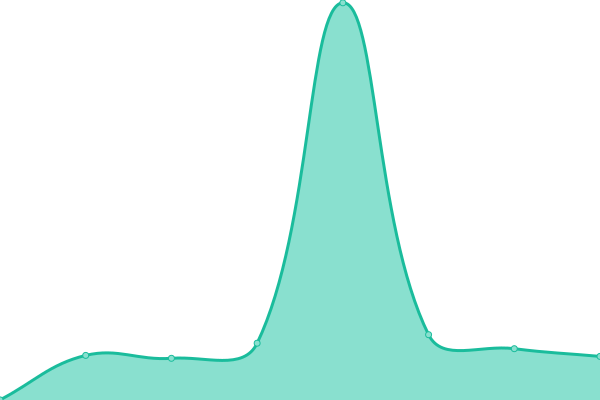 464ms
     
 | 

<a href="https://jgui1129.github.io/UTD-Sites-Status-Checker/history/bamboe-belgie">100.00%</a>
    

|  [Ban Vlaanderen](https://blog.ban.be) | 🟩 Up | [ban-vlaanderen.yml](https://github.com/jgui1129/UTD-Sites-Status-Checker/commits/HEAD/history/ban-vlaanderen.yml) | 

 548ms
     
 | 

<a href="https://jgui1129.github.io/UTD-Sites-Status-Checker/history/ban-vlaanderen">100.00%</a>
    

|  [Bankirai](https://www.bankiraiterras.be) | 🟩 Up | [bankirai.yml](https://github.com/jgui1129/UTD-Sites-Status-Checker/commits/HEAD/history/bankirai.yml) | 

 502ms
     
 | 

<a href="https://jgui1129.github.io/UTD-Sites-Status-Checker/history/bankirai">100.00%</a>
    

|  [BBTK](https://www.bbtklimburg.be) | 🟩 Up | [bbtk.yml](https://github.com/jgui1129/UTD-Sites-Status-Checker/commits/HEAD/history/bbtk.yml) | 

 465ms
     
 | 

<a href="https://jgui1129.github.io/UTD-Sites-Status-Checker/history/bbtk">100.00%</a>
    

|  [BC Onderhoud](https://www.bconderhoud.be) | 🟩 Up | [bc-onderhoud.yml](https://github.com/jgui1129/UTD-Sites-Status-Checker/commits/HEAD/history/bc-onderhoud.yml) | 

 601ms
     
 | 

<a href="https://jgui1129.github.io/UTD-Sites-Status-Checker/history/bc-onderhoud">100.00%</a>
    

|  [Bexx Verhuur](https://www.bexxverhuur.be) | 🟩 Up | [bexx-verhuur.yml](https://github.com/jgui1129/UTD-Sites-Status-Checker/commits/HEAD/history/bexx-verhuur.yml) | 

 449ms
     
 | 

<a href="https://jgui1129.github.io/UTD-Sites-Status-Checker/history/bexx-verhuur">100.00%</a>
    

|  [Bijnen Verwarming](https://www.bijnens-verwarming.be) | 🟩 Up | [bijnen-verwarming.yml](https://github.com/jgui1129/UTD-Sites-Status-Checker/commits/HEAD/history/bijnen-verwarming.yml) | 

 460ms
     
 | 

<a href="https://jgui1129.github.io/UTD-Sites-Status-Checker/history/bijnen-verwarming">100.00%</a>
    

|  [Bikes Claessens](https://www.bikesclaessens.com) | 🟩 Up | [bikes-claessens.yml](https://github.com/jgui1129/UTD-Sites-Status-Checker/commits/HEAD/history/bikes-claessens.yml) | 

 423ms
     
 | 

<a href="https://jgui1129.github.io/UTD-Sites-Status-Checker/history/bikes-claessens">100.00%</a>
    

|  [Bleublue](https://www.bleublue.be) | 🟩 Up | [bleublue.yml](https://github.com/jgui1129/UTD-Sites-Status-Checker/commits/HEAD/history/bleublue.yml) | 

 497ms
     
 | 

<a href="https://jgui1129.github.io/UTD-Sites-Status-Checker/history/bleublue">100.00%</a>
    

|  [BMP Building Services](https://www.bmpbuildingservices.be) | 🟩 Up | [bmp-building-services.yml](https://github.com/jgui1129/UTD-Sites-Status-Checker/commits/HEAD/history/bmp-building-services.yml) | 

 448ms
     
 | 

<a href="https://jgui1129.github.io/UTD-Sites-Status-Checker/history/bmp-building-services">100.00%</a>
    

|  [Boomkwekerij Kelbergen](https://www.boomkwekerij-kelbergen.be) | 🟩 Up | [boomkwekerij-kelbergen.yml](https://github.com/jgui1129/UTD-Sites-Status-Checker/commits/HEAD/history/boomkwekerij-kelbergen.yml) | 

 466ms
     
 | 

<a href="https://jgui1129.github.io/UTD-Sites-Status-Checker/history/boomkwekerij-kelbergen">100.00%</a>
    

|  [Broeders Bakerrij](https://www.broedersbakkerijservice.be) | 🟩 Up | [broeders-bakerrij.yml](https://github.com/jgui1129/UTD-Sites-Status-Checker/commits/HEAD/history/broeders-bakerrij.yml) | 

 471ms
     
 | 

<a href="https://jgui1129.github.io/UTD-Sites-Status-Checker/history/broeders-bakerrij">100.00%</a>
    

|  [C & G Construct](https://www.cgconstruct.be) | 🟩 Up | [c-and-g-construct.yml](https://github.com/jgui1129/UTD-Sites-Status-Checker/commits/HEAD/history/c-and-g-construct.yml) | 

 448ms
     
 | 

<a href="https://jgui1129.github.io/UTD-Sites-Status-Checker/history/c-and-g-construct">100.00%</a>
    

|  [Chipps NL](https://blog-nl.chipps.be) | 🟩 Up | [chipps-nl.yml](https://github.com/jgui1129/UTD-Sites-Status-Checker/commits/HEAD/history/chipps-nl.yml) | 

 633ms
     
 | 

<a href="https://jgui1129.github.io/UTD-Sites-Status-Checker/history/chipps-nl">100.00%</a>
    

|  [Connectivity Solutions](https://www.connectivitysolutions.be) | 🟩 Up | [connectivity-solutions.yml](https://github.com/jgui1129/UTD-Sites-Status-Checker/commits/HEAD/history/connectivity-solutions.yml) | 

 456ms
     
 | 

<a href="https://jgui1129.github.io/UTD-Sites-Status-Checker/history/connectivity-solutions">100.00%</a>
    

|  [Corvers](https://www.corversasfaltwerken.be) | 🟩 Up | [corvers.yml](https://github.com/jgui1129/UTD-Sites-Status-Checker/commits/HEAD/history/corvers.yml) | 

 501ms
     
 | 

<a href="https://jgui1129.github.io/UTD-Sites-Status-Checker/history/corvers">100.00%</a>
    

|  [Cring](https://www.cring.be) | 🟩 Up | [cring.yml](https://github.com/jgui1129/UTD-Sites-Status-Checker/commits/HEAD/history/cring.yml) | 

 646ms
     
 | 

<a href="https://jgui1129.github.io/UTD-Sites-Status-Checker/history/cring">100.00%</a>
    

|  [Dajoka](https://www.dajoka.be) | 🟩 Up | [dajoka.yml](https://github.com/jgui1129/UTD-Sites-Status-Checker/commits/HEAD/history/dajoka.yml) | 

 594ms
     
 | 

<a href="https://jgui1129.github.io/UTD-Sites-Status-Checker/history/dajoka">100.00%</a>
    

|  [Daro Veranda](https://www.daroverandas.be) | 🟩 Up | [daro-veranda.yml](https://github.com/jgui1129/UTD-Sites-Status-Checker/commits/HEAD/history/daro-veranda.yml) | 

 577ms
     
 | 

<a href="https://jgui1129.github.io/UTD-Sites-Status-Checker/history/daro-veranda">100.00%</a>
    

|  [De Kolibrie](https://www.dekolibrie.be) | 🟩 Up | [de-kolibrie.yml](https://github.com/jgui1129/UTD-Sites-Status-Checker/commits/HEAD/history/de-kolibrie.yml) | 

 542ms
     
 | 

<a href="https://jgui1129.github.io/UTD-Sites-Status-Checker/history/de-kolibrie">100.00%</a>
    

|  [De ridder](https://www.bvderidder.be) | 🟩 Up | [de-ridder.yml](https://github.com/jgui1129/UTD-Sites-Status-Checker/commits/HEAD/history/de-ridder.yml) | 

 362ms
     
 | 

<a href="https://jgui1129.github.io/UTD-Sites-Status-Checker/history/de-ridder">100.00%</a>
    

|  [De Terrasplaatser](https://www.deterrasplaatser.be) | 🟩 Up | [de-terrasplaatser.yml](https://github.com/jgui1129/UTD-Sites-Status-Checker/commits/HEAD/history/de-terrasplaatser.yml) | 

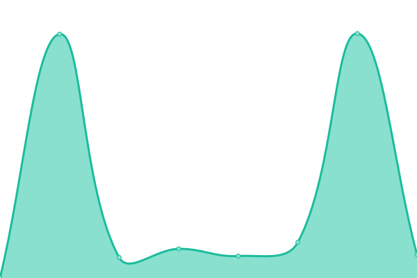 472ms
     
 | 

<a href="https://jgui1129.github.io/UTD-Sites-Status-Checker/history/de-terrasplaatser">100.00%</a>
    

|  [Decoene Porsche](https://www.porsche-parts.be) | 🟩 Up | [decoene-porsche.yml](https://github.com/jgui1129/UTD-Sites-Status-Checker/commits/HEAD/history/decoene-porsche.yml) | 

 452ms
     
 | 

<a href="https://jgui1129.github.io/UTD-Sites-Status-Checker/history/decoene-porsche">100.00%</a>
    

|  [Diabeton](https://www.diabeton.be) | 🟩 Up | [diabeton.yml](https://github.com/jgui1129/UTD-Sites-Status-Checker/commits/HEAD/history/diabeton.yml) | 

 620ms
     
 | 

<a href="https://jgui1129.github.io/UTD-Sites-Status-Checker/history/diabeton">100.00%</a>
    

|  [Diaspoor](https://blog.diaspoor.be) | 🟩 Up | [diaspoor.yml](https://github.com/jgui1129/UTD-Sites-Status-Checker/commits/HEAD/history/diaspoor.yml) | 

 563ms
     
 | 

<a href="https://jgui1129.github.io/UTD-Sites-Status-Checker/history/diaspoor">100.00%</a>
    

|  [Dillen](https://www.dillen.be) | 🟩 Up | [dillen.yml](https://github.com/jgui1129/UTD-Sites-Status-Checker/commits/HEAD/history/dillen.yml) | 

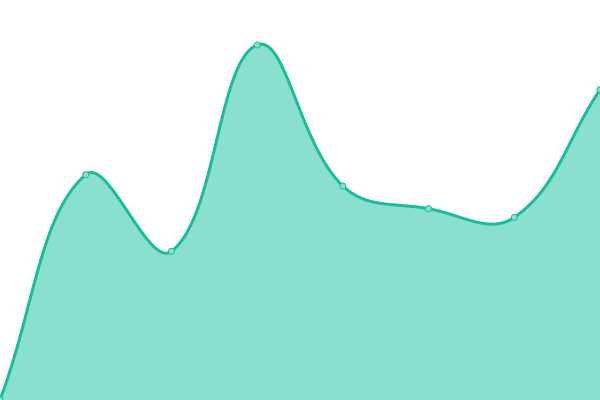 1097ms
     
 | 

<a href="https://jgui1129.github.io/UTD-Sites-Status-Checker/history/dillen">100.00%</a>
    

|  [Dipsss](https://www.dipsss.be) | 🟩 Up | [dipsss.yml](https://github.com/jgui1129/UTD-Sites-Status-Checker/commits/HEAD/history/dipsss.yml) | 

 1272ms
     
 | 

<a href="https://jgui1129.github.io/UTD-Sites-Status-Checker/history/dipsss">100.00%</a>
    

|  [Distrikt Projectontwikkeling](https://www.distrikt.immo) | 🟩 Up | [distrikt-projectontwikkeling.yml](https://github.com/jgui1129/UTD-Sites-Status-Checker/commits/HEAD/history/distrikt-projectontwikkeling.yml) | 

 803ms
     
 | 

<a href="https://jgui1129.github.io/UTD-Sites-Status-Checker/history/distrikt-projectontwikkeling">100.00%</a>
    

|  [DLD Pools](https://blog-nl.dldpools.be) | 🟩 Up | [dld-pools.yml](https://github.com/jgui1129/UTD-Sites-Status-Checker/commits/HEAD/history/dld-pools.yml) | 

 820ms
     
 | 

<a href="https://jgui1129.github.io/UTD-Sites-Status-Checker/history/dld-pools">100.00%</a>
    

|  [Drukkerij Nelma](https://www.nelma.be) | 🟩 Up | [drukkerij-nelma.yml](https://github.com/jgui1129/UTD-Sites-Status-Checker/commits/HEAD/history/drukkerij-nelma.yml) | 

 458ms
     
 | 

<a href="https://jgui1129.github.io/UTD-Sites-Status-Checker/history/drukkerij-nelma">100.00%</a>
    

|  [Electro Ghys](https://blog.electroghys.be) | 🟩 Up | [electro-ghys.yml](https://github.com/jgui1129/UTD-Sites-Status-Checker/commits/HEAD/history/electro-ghys.yml) | 

 371ms
     
 | 

<a href="https://jgui1129.github.io/UTD-Sites-Status-Checker/history/electro-ghys">100.00%</a>
    

|  [Electro Solutions](https://www.electro-solutions.be) | 🟩 Up | [electro-solutions.yml](https://github.com/jgui1129/UTD-Sites-Status-Checker/commits/HEAD/history/electro-solutions.yml) | 

 435ms
     
 | 

<a href="https://jgui1129.github.io/UTD-Sites-Status-Checker/history/electro-solutions">100.00%</a>
    

|  [Ellicars Blog](https://blog.ellicars.be) | 🟩 Up | [ellicars-blog.yml](https://github.com/jgui1129/UTD-Sites-Status-Checker/commits/HEAD/history/ellicars-blog.yml) | 

 527ms
     
 | 

<a href="https://jgui1129.github.io/UTD-Sites-Status-Checker/history/ellicars-blog">100.00%</a>
    

|  [Emmers](https://academy.emmers.eu) | 🟩 Up | [emmers.yml](https://github.com/jgui1129/UTD-Sites-Status-Checker/commits/HEAD/history/emmers.yml) | 

 349ms
     
 | 

<a href="https://jgui1129.github.io/UTD-Sites-Status-Checker/history/emmers">100.00%</a>
    

|  [Escape Room Genk](https://www.escaperoomlimburg.be) | 🟩 Up | [escape-room-genk.yml](https://github.com/jgui1129/UTD-Sites-Status-Checker/commits/HEAD/history/escape-room-genk.yml) | 

 454ms
     
 | 

<a href="https://jgui1129.github.io/UTD-Sites-Status-Checker/history/escape-room-genk">100.00%</a>
    

|  [ESMA](https://www.esma.be) | 🟩 Up | [esma.yml](https://github.com/jgui1129/UTD-Sites-Status-Checker/commits/HEAD/history/esma.yml) | 

 1810ms
     
 | 

<a href="https://jgui1129.github.io/UTD-Sites-Status-Checker/history/esma">99.31%</a>
    

|  [Europ Electric](https://www.europelectric.be) | 🟩 Up | [europ-electric.yml](https://github.com/jgui1129/UTD-Sites-Status-Checker/commits/HEAD/history/europ-electric.yml) | 

 521ms
     
 | 

<a href="https://jgui1129.github.io/UTD-Sites-Status-Checker/history/europ-electric">100.00%</a>
    

|  [Eurosol](https://www.eurosol.be) | 🟩 Up | [eurosol.yml](https://github.com/jgui1129/UTD-Sites-Status-Checker/commits/HEAD/history/eurosol.yml) | 

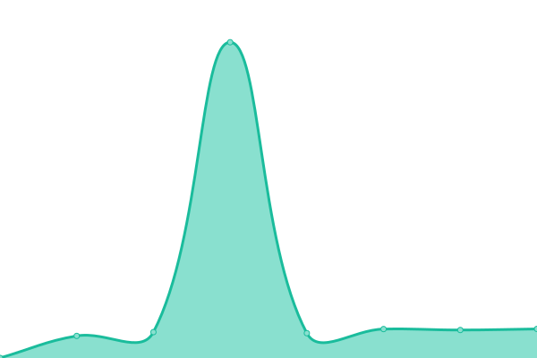 480ms
     
 | 

<a href="https://jgui1129.github.io/UTD-Sites-Status-Checker/history/eurosol">100.00%</a>
    

|  [Farm Beef Boutique](https://www.farmbeefboutique.be) | 🟩 Up | [farm-beef-boutique.yml](https://github.com/jgui1129/UTD-Sites-Status-Checker/commits/HEAD/history/farm-beef-boutique.yml) | 

 464ms
     
 | 

<a href="https://jgui1129.github.io/UTD-Sites-Status-Checker/history/farm-beef-boutique">100.00%</a>
    

|  [Fietsen Bart](https://www.fietsenbart.be/) | 🟩 Up | [fietsen-bart.yml](https://github.com/jgui1129/UTD-Sites-Status-Checker/commits/HEAD/history/fietsen-bart.yml) | 

 535ms
     
 | 

<a href="https://jgui1129.github.io/UTD-Sites-Status-Checker/history/fietsen-bart">100.00%</a>
    

|  [Fietsen Decker](https://blog.fietsendeckers.be) | 🟩 Up | [fietsen-decker.yml](https://github.com/jgui1129/UTD-Sites-Status-Checker/commits/HEAD/history/fietsen-decker.yml) | 

 988ms
     
 | 

<a href="https://jgui1129.github.io/UTD-Sites-Status-Checker/history/fietsen-decker">100.00%</a>
    

|  [Fietsen Kim](https://www.fietsenkim.be) | 🟩 Up | [fietsen-kim.yml](https://github.com/jgui1129/UTD-Sites-Status-Checker/commits/HEAD/history/fietsen-kim.yml) | 

 451ms
     
 | 

<a href="https://jgui1129.github.io/UTD-Sites-Status-Checker/history/fietsen-kim">100.00%</a>
    

|  [Fietsen Smets](https://blog.fietsensmets.be) | 🟩 Up | [fietsen-smets.yml](https://github.com/jgui1129/UTD-Sites-Status-Checker/commits/HEAD/history/fietsen-smets.yml) | 

 621ms
     
 | 

<a href="https://jgui1129.github.io/UTD-Sites-Status-Checker/history/fietsen-smets">100.00%</a>
    

|  [Flanders Food Production DE](https://www.flandersfoodproductions.de) | 🟩 Up | [flanders-food-production-de.yml](https://github.com/jgui1129/UTD-Sites-Status-Checker/commits/HEAD/history/flanders-food-production-de.yml) | 

 549ms
     
 | 

<a href="https://jgui1129.github.io/UTD-Sites-Status-Checker/history/flanders-food-production-de">100.00%</a>
    

|  [Flanders Food Production EN](https://www.flandersfoodproductions.com) | 🟩 Up | [flanders-food-production-en.yml](https://github.com/jgui1129/UTD-Sites-Status-Checker/commits/HEAD/history/flanders-food-production-en.yml) | 

 471ms
     
 | 

<a href="https://jgui1129.github.io/UTD-Sites-Status-Checker/history/flanders-food-production-en">100.00%</a>
    

|  [Flanders Food Production FR](https://www.flandersfoodproductions.fr) | 🟩 Up | [flanders-food-production-fr.yml](https://github.com/jgui1129/UTD-Sites-Status-Checker/commits/HEAD/history/flanders-food-production-fr.yml) | 

 473ms
     
 | 

<a href="https://jgui1129.github.io/UTD-Sites-Status-Checker/history/flanders-food-production-fr">100.00%</a>
    

|  [Flanders Food Production NL](https://www.flandersfoodproductions.be) | 🟩 Up | [flanders-food-production-nl.yml](https://github.com/jgui1129/UTD-Sites-Status-Checker/commits/HEAD/history/flanders-food-production-nl.yml) | 

 371ms
     
 | 

<a href="https://jgui1129.github.io/UTD-Sites-Status-Checker/history/flanders-food-production-nl">100.00%</a>
    

|  [Food 2 Taste](https://www.food2taste.be) | 🟩 Up | [food-2-taste.yml](https://github.com/jgui1129/UTD-Sites-Status-Checker/commits/HEAD/history/food-2-taste.yml) | 

 449ms
     
 | 

<a href="https://jgui1129.github.io/UTD-Sites-Status-Checker/history/food-2-taste">100.00%</a>
    

|  [Foxy Frozen Dreams](https://www.foxyfrozendreams.be) | 🟩 Up | [foxy-frozen-dreams.yml](https://github.com/jgui1129/UTD-Sites-Status-Checker/commits/HEAD/history/foxy-frozen-dreams.yml) | 

 551ms
     
 | 

<a href="https://jgui1129.github.io/UTD-Sites-Status-Checker/history/foxy-frozen-dreams">100.00%</a>
    

|  [Foxy Frozen Dreams FR](https://fr.foxyfrozendreams.be) | 🟩 Up | [foxy-frozen-dreams-fr.yml](https://github.com/jgui1129/UTD-Sites-Status-Checker/commits/HEAD/history/foxy-frozen-dreams-fr.yml) | 

 537ms
     
 | 

<a href="https://jgui1129.github.io/UTD-Sites-Status-Checker/history/foxy-frozen-dreams-fr">100.00%</a>
    

|  [Geurts](https://www.geurtsh.be) | 🟩 Up | [geurts.yml](https://github.com/jgui1129/UTD-Sites-Status-Checker/commits/HEAD/history/geurts.yml) | 

 485ms
     
 | 

<a href="https://jgui1129.github.io/UTD-Sites-Status-Checker/history/geurts">100.00%</a>
    

|  [Glaswerken Vigoureux](https://www.vigoureux.be) | 🟩 Up | [glaswerken-vigoureux.yml](https://github.com/jgui1129/UTD-Sites-Status-Checker/commits/HEAD/history/glaswerken-vigoureux.yml) | 

 504ms
     
 | 

<a href="https://jgui1129.github.io/UTD-Sites-Status-Checker/history/glaswerken-vigoureux">100.00%</a>
    

|  [GM Projects](https://www.gm-projects.be) | 🟩 Up | [gm-projects.yml](https://github.com/jgui1129/UTD-Sites-Status-Checker/commits/HEAD/history/gm-projects.yml) | 

 531ms
     
 | 

<a href="https://jgui1129.github.io/UTD-Sites-Status-Checker/history/gm-projects">100.00%</a>
    

|  [Groep Claesen](https://blog.claesen.be) | 🟥 Down | [groep-claesen.yml](https://github.com/jgui1129/UTD-Sites-Status-Checker/commits/HEAD/history/groep-claesen.yml) | 

 1027ms
     
 | 

<a href="https://jgui1129.github.io/UTD-Sites-Status-Checker/history/groep-claesen">99.94%</a>
    

|  [Groep FJK](https://www.groepfjk.be) | 🟩 Up | [groep-fjk.yml](https://github.com/jgui1129/UTD-Sites-Status-Checker/commits/HEAD/history/groep-fjk.yml) | 

 601ms
     
 | 

<a href="https://jgui1129.github.io/UTD-Sites-Status-Checker/history/groep-fjk">100.00%</a>
    

|  [Haarwerken45](https://www.haarwerken45.be) | 🟥 Down | [haarwerken45.yml](https://github.com/jgui1129/UTD-Sites-Status-Checker/commits/HEAD/history/haarwerken45.yml) | 

 501ms
     
 | 

<a href="https://jgui1129.github.io/UTD-Sites-Status-Checker/history/haarwerken45">99.94%</a>
    

|  [Handico Trucking](https://www.handico-trucking.com) | 🟩 Up | [handico-trucking.yml](https://github.com/jgui1129/UTD-Sites-Status-Checker/commits/HEAD/history/handico-trucking.yml) | 

 600ms
     
 | 

<a href="https://jgui1129.github.io/UTD-Sites-Status-Checker/history/handico-trucking">100.00%</a>
    

|  [Haru Tools](https://www.harutools.be) | 🟩 Up | [haru-tools.yml](https://github.com/jgui1129/UTD-Sites-Status-Checker/commits/HEAD/history/haru-tools.yml) | 

 501ms
     
 | 

<a href="https://jgui1129.github.io/UTD-Sites-Status-Checker/history/haru-tools">100.00%</a>
    

|  [Hendrix Dakbedekking](https://www.hendrixdakbedekking.com) | 🟩 Up | [hendrix-dakbedekking.yml](https://github.com/jgui1129/UTD-Sites-Status-Checker/commits/HEAD/history/hendrix-dakbedekking.yml) | 

 1147ms
     
 | 

<a href="https://jgui1129.github.io/UTD-Sites-Status-Checker/history/hendrix-dakbedekking">100.00%</a>
    

|  [Hercorub](https://www.hercorub.be) | 🟩 Up | [hercorub.yml](https://github.com/jgui1129/UTD-Sites-Status-Checker/commits/HEAD/history/hercorub.yml) | 

 466ms
     
 | 

<a href="https://jgui1129.github.io/UTD-Sites-Status-Checker/history/hercorub">100.00%</a>
    

|  [Hercorub - En](https://www.hercorub.com) | 🟩 Up | [hercorub-en.yml](https://github.com/jgui1129/UTD-Sites-Status-Checker/commits/HEAD/history/hercorub-en.yml) | 

 565ms
     
 | 

<a href="https://jgui1129.github.io/UTD-Sites-Status-Checker/history/hercorub-en">100.00%</a>
    

|  [Hermans](https://www.hermansbvba.be) | 🟩 Up | [hermans.yml](https://github.com/jgui1129/UTD-Sites-Status-Checker/commits/HEAD/history/hermans.yml) | 

 465ms
     
 | 

<a href="https://jgui1129.github.io/UTD-Sites-Status-Checker/history/hermans">100.00%</a>
    

|  [Honinx](https://www.honinx.be) | 🟩 Up | [honinx.yml](https://github.com/jgui1129/UTD-Sites-Status-Checker/commits/HEAD/history/honinx.yml) | 

 551ms
     
 | 

<a href="https://jgui1129.github.io/UTD-Sites-Status-Checker/history/honinx">100.00%</a>
    

|  [HOST NOL](https://www.host-nol.be) | 🟩 Up | [host-nol.yml](https://github.com/jgui1129/UTD-Sites-Status-Checker/commits/HEAD/history/host-nol.yml) | 

 492ms
     
 | 

<a href="https://jgui1129.github.io/UTD-Sites-Status-Checker/history/host-nol">100.00%</a>
    

|  [Huis Casterman](https://www.huiscastermans.be) | 🟩 Up | [huis-casterman.yml](https://github.com/jgui1129/UTD-Sites-Status-Checker/commits/HEAD/history/huis-casterman.yml) | 

 591ms
     
 | 

<a href="https://jgui1129.github.io/UTD-Sites-Status-Checker/history/huis-casterman">100.00%</a>
    

|  [ICL Arbeid](https://www.iclarbeid.nl) | 🟩 Up | [icl-arbeid.yml](https://github.com/jgui1129/UTD-Sites-Status-Checker/commits/HEAD/history/icl-arbeid.yml) | 

 1333ms
     
 | 

<a href="https://jgui1129.github.io/UTD-Sites-Status-Checker/history/icl-arbeid">99.31%</a>
    

|  [Ideashooter](https://www.ideashooter.com/) | 🟩 Up | [ideashooter.yml](https://github.com/jgui1129/UTD-Sites-Status-Checker/commits/HEAD/history/ideashooter.yml) | 

 512ms
     
 | 

<a href="https://jgui1129.github.io/UTD-Sites-Status-Checker/history/ideashooter">100.00%</a>
    

|  [IKP Engineering](https://www.ikp-engineering.be) | 🟩 Up | [ikp-engineering.yml](https://github.com/jgui1129/UTD-Sites-Status-Checker/commits/HEAD/history/ikp-engineering.yml) | 

 562ms
     
 | 

<a href="https://jgui1129.github.io/UTD-Sites-Status-Checker/history/ikp-engineering">100.00%</a>
    

|  [InTrust](https://blog.intrust.be) | 🟩 Up | [in-trust.yml](https://github.com/jgui1129/UTD-Sites-Status-Checker/commits/HEAD/history/in-trust.yml) | 

 1334ms
     
 | 

<a href="https://jgui1129.github.io/UTD-Sites-Status-Checker/history/in-trust">99.39%</a>
    

|  [JaBo Bikes](https://www.jabobikes.be) | 🟩 Up | [ja-bo-bikes.yml](https://github.com/jgui1129/UTD-Sites-Status-Checker/commits/HEAD/history/ja-bo-bikes.yml) | 

 500ms
     
 | 

<a href="https://jgui1129.github.io/UTD-Sites-Status-Checker/history/ja-bo-bikes">100.00%</a>
    

|  [JL Service](https://www.jlservice.be) | 🟩 Up | [jl-service.yml](https://github.com/jgui1129/UTD-Sites-Status-Checker/commits/HEAD/history/jl-service.yml) | 

 500ms
     
 | 

<a href="https://jgui1129.github.io/UTD-Sites-Status-Checker/history/jl-service">100.00%</a>
    

|  [Juwelier](https://blog.juwelier-willems.be) | 🟩 Up | [juwelier.yml](https://github.com/jgui1129/UTD-Sites-Status-Checker/commits/HEAD/history/juwelier.yml) | 

 837ms
     
 | 

<a href="https://jgui1129.github.io/UTD-Sites-Status-Checker/history/juwelier">99.40%</a>
    

|  [Karcher Center Palmaers Shop](https://shop.karchercenterpalmaers.be) | 🟩 Up | [karcher-center-palmaers-shop.yml](https://github.com/jgui1129/UTD-Sites-Status-Checker/commits/HEAD/history/karcher-center-palmaers-shop.yml) | 

 856ms
     
 | 

<a href="https://jgui1129.github.io/UTD-Sites-Status-Checker/history/karcher-center-palmaers-shop">100.00%</a>
    

|  [karchercenterpalmaers](https://www.karchercenterpalmaers.be) | 🟩 Up | [karchercenterpalmaers.yml](https://github.com/jgui1129/UTD-Sites-Status-Checker/commits/HEAD/history/karchercenterpalmaers.yml) | 

 501ms
     
 | 

<a href="https://jgui1129.github.io/UTD-Sites-Status-Checker/history/karchercenterpalmaers">100.00%</a>
    

|  [Keulen Beton](https://www.keulenbeton.be) | 🟩 Up | [keulen-beton.yml](https://github.com/jgui1129/UTD-Sites-Status-Checker/commits/HEAD/history/keulen-beton.yml) | 

 556ms
     
 | 

<a href="https://jgui1129.github.io/UTD-Sites-Status-Checker/history/keulen-beton">100.00%</a>
    

|  [KickCity Genk](https://www.kickcity.be) | 🟩 Up | [kick-city-genk.yml](https://github.com/jgui1129/UTD-Sites-Status-Checker/commits/HEAD/history/kick-city-genk.yml) | 

 423ms
     
 | 

<a href="https://jgui1129.github.io/UTD-Sites-Status-Checker/history/kick-city-genk">100.00%</a>
    

|  [Kinderpraktijk](https://www.kinderpraktijk.eu) | 🟩 Up | [kinderpraktijk.yml](https://github.com/jgui1129/UTD-Sites-Status-Checker/commits/HEAD/history/kinderpraktijk.yml) | 

 600ms
     
 | 

<a href="https://jgui1129.github.io/UTD-Sites-Status-Checker/history/kinderpraktijk">100.00%</a>
    

|  [Kinderrijck](https://www.kinderrijck.be) | 🟩 Up | [kinderrijck.yml](https://github.com/jgui1129/UTD-Sites-Status-Checker/commits/HEAD/history/kinderrijck.yml) | 

 587ms
     
 | 

<a href="https://jgui1129.github.io/UTD-Sites-Status-Checker/history/kinderrijck">100.00%</a>
    

|  [Kristof van dun](https://www.kvdhoutbouw.be) | 🟩 Up | [kristof-van-dun.yml](https://github.com/jgui1129/UTD-Sites-Status-Checker/commits/HEAD/history/kristof-van-dun.yml) | 

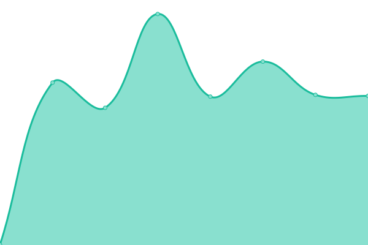 464ms
     
 | 

<a href="https://jgui1129.github.io/UTD-Sites-Status-Checker/history/kristof-van-dun">99.32%</a>
    

|  [La nuit Slaapcomfort](https://www.lanuit.be) | 🟩 Up | [la-nuit-slaapcomfort.yml](https://github.com/jgui1129/UTD-Sites-Status-Checker/commits/HEAD/history/la-nuit-slaapcomfort.yml) | 

 468ms
     
 | 

<a href="https://jgui1129.github.io/UTD-Sites-Status-Checker/history/la-nuit-slaapcomfort">100.00%</a>
    

|  [Ligna Pharma](https://www.lignapharma.be) | 🟩 Up | [ligna-pharma.yml](https://github.com/jgui1129/UTD-Sites-Status-Checker/commits/HEAD/history/ligna-pharma.yml) | 

 433ms
     
 | 

<a href="https://jgui1129.github.io/UTD-Sites-Status-Checker/history/ligna-pharma">100.00%</a>
    

|  [Lima Kas](https://www.limakas.com) | 🟩 Up | [lima-kas.yml](https://github.com/jgui1129/UTD-Sites-Status-Checker/commits/HEAD/history/lima-kas.yml) | 

 453ms
     
 | 

<a href="https://jgui1129.github.io/UTD-Sites-Status-Checker/history/lima-kas">100.00%</a>
    

|  [Lindelo](https://www.lindelo.be) | 🟩 Up | [lindelo.yml](https://github.com/jgui1129/UTD-Sites-Status-Checker/commits/HEAD/history/lindelo.yml) | 

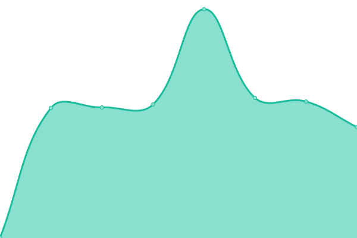 1292ms
     
 | 

<a href="https://jgui1129.github.io/UTD-Sites-Status-Checker/history/lindelo">99.41%</a>
    

|  [Luna Sun](https://www.lunasun.be) | 🟩 Up | [luna-sun.yml](https://github.com/jgui1129/UTD-Sites-Status-Checker/commits/HEAD/history/luna-sun.yml) | 

 481ms
     
 | 

<a href="https://jgui1129.github.io/UTD-Sites-Status-Checker/history/luna-sun">100.00%</a>
    

|  [M-bike](https://www.m-bike.be) | 🟩 Up | [m-bike.yml](https://github.com/jgui1129/UTD-Sites-Status-Checker/commits/HEAD/history/m-bike.yml) | 

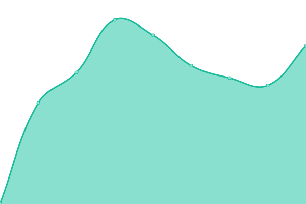 576ms
     
 | 

<a href="https://jgui1129.github.io/UTD-Sites-Status-Checker/history/m-bike">100.00%</a>
    

|  [Maric](https://www.bouwbedrijfmaric.be) | 🟩 Up | [maric.yml](https://github.com/jgui1129/UTD-Sites-Status-Checker/commits/HEAD/history/maric.yml) | 

 505ms
     
 | 

<a href="https://jgui1129.github.io/UTD-Sites-Status-Checker/history/maric">100.00%</a>
    

|  [Martin Vandereyt Groep](https://www.martinvandereytgroep.be) | 🟩 Up | [martin-vandereyt-groep.yml](https://github.com/jgui1129/UTD-Sites-Status-Checker/commits/HEAD/history/martin-vandereyt-groep.yml) | 

 494ms
     
 | 

<a href="https://jgui1129.github.io/UTD-Sites-Status-Checker/history/martin-vandereyt-groep">100.00%</a>
    

|  [Mind Matter](https://www.mindmatter.be) | 🟩 Up | [mind-matter.yml](https://github.com/jgui1129/UTD-Sites-Status-Checker/commits/HEAD/history/mind-matter.yml) | 

 473ms
     
 | 

<a href="https://jgui1129.github.io/UTD-Sites-Status-Checker/history/mind-matter">99.41%</a>
    

|  [Nancy Wijnants](https://www.nancywijnants.com) | 🟩 Up | [nancy-wijnants.yml](https://github.com/jgui1129/UTD-Sites-Status-Checker/commits/HEAD/history/nancy-wijnants.yml) | 

 554ms
     
 | 

<a href="https://jgui1129.github.io/UTD-Sites-Status-Checker/history/nancy-wijnants">99.41%</a>
    

|  [Natuursteen Vanham](https://www.natuursteen-vanham.be) | 🟩 Up | [natuursteen-vanham.yml](https://github.com/jgui1129/UTD-Sites-Status-Checker/commits/HEAD/history/natuursteen-vanham.yml) | 

 355ms
     
 | 

<a href="https://jgui1129.github.io/UTD-Sites-Status-Checker/history/natuursteen-vanham">100.00%</a>
    

|  [Neudebri](https://www.neudebri.com) | 🟩 Up | [neudebri.yml](https://github.com/jgui1129/UTD-Sites-Status-Checker/commits/HEAD/history/neudebri.yml) | 

 438ms
     
 | 

<a href="https://jgui1129.github.io/UTD-Sites-Status-Checker/history/neudebri">100.00%</a>
    

|  [Nicole Jansen](https://blog.nicolejanssen.be) | 🟩 Up | [nicole-jansen.yml](https://github.com/jgui1129/UTD-Sites-Status-Checker/commits/HEAD/history/nicole-jansen.yml) | 

 720ms
     
 | 

<a href="https://jgui1129.github.io/UTD-Sites-Status-Checker/history/nicole-jansen">100.00%</a>
    

|  [Noa Training (Blog)](https://blog.noatrainings.be) | 🟩 Up | [noa-training-blog.yml](https://github.com/jgui1129/UTD-Sites-Status-Checker/commits/HEAD/history/noa-training-blog.yml) | 

 469ms
     
 | 

<a href="https://jgui1129.github.io/UTD-Sites-Status-Checker/history/noa-training-blog">100.00%</a>
    

|  [Nuts about nuts](https://www.nutsaboutnuts.be) | 🟩 Up | [nuts-about-nuts.yml](https://github.com/jgui1129/UTD-Sites-Status-Checker/commits/HEAD/history/nuts-about-nuts.yml) | 

 564ms
     
 | 

<a href="https://jgui1129.github.io/UTD-Sites-Status-Checker/history/nuts-about-nuts">100.00%</a>
    

|  [Officenter Group](https://blog.officenter.eu) | 🟩 Up | [officenter-group.yml](https://github.com/jgui1129/UTD-Sites-Status-Checker/commits/HEAD/history/officenter-group.yml) | 

 683ms
     
 | 

<a href="https://jgui1129.github.io/UTD-Sites-Status-Checker/history/officenter-group">100.00%</a>
    

|  [Onroerendgoed te koop](https://blog.onroerendgoedtekoop.be) | 🟩 Up | [onroerendgoed-te-koop.yml](https://github.com/jgui1129/UTD-Sites-Status-Checker/commits/HEAD/history/onroerendgoed-te-koop.yml) | 

 513ms
     
 | 

<a href="https://jgui1129.github.io/UTD-Sites-Status-Checker/history/onroerendgoed-te-koop">100.00%</a>
    

|  [Paesen](https://www.paesenneyens.be) | 🟩 Up | [paesen.yml](https://github.com/jgui1129/UTD-Sites-Status-Checker/commits/HEAD/history/paesen.yml) | 

 447ms
     
 | 

<a href="https://jgui1129.github.io/UTD-Sites-Status-Checker/history/paesen">100.00%</a>
    

|  [Parquet Europe](https://www.parquet.net) | 🟩 Up | [parquet-europe.yml](https://github.com/jgui1129/UTD-Sites-Status-Checker/commits/HEAD/history/parquet-europe.yml) | 

 476ms
     
 | 

<a href="https://jgui1129.github.io/UTD-Sites-Status-Checker/history/parquet-europe">100.00%</a>
    

|  [Portfolio webdesign](https://portfolio.uptodatewebdesign.be/) | 🟩 Up | [portfolio-webdesign.yml](https://github.com/jgui1129/UTD-Sites-Status-Checker/commits/HEAD/history/portfolio-webdesign.yml) | 

 527ms
     
 | 

<a href="https://jgui1129.github.io/UTD-Sites-Status-Checker/history/portfolio-webdesign">100.00%</a>
    

|  [Prana](https://www.pranashiatsupraktijk.be) | 🟩 Up | [prana.yml](https://github.com/jgui1129/UTD-Sites-Status-Checker/commits/HEAD/history/prana.yml) | 

 501ms
     
 | 

<a href="https://jgui1129.github.io/UTD-Sites-Status-Checker/history/prana">100.00%</a>
    

|  [Procos](https://www.procosprojectmeubel.be) | 🟩 Up | [procos.yml](https://github.com/jgui1129/UTD-Sites-Status-Checker/commits/HEAD/history/procos.yml) | 

 510ms
     
 | 

<a href="https://jgui1129.github.io/UTD-Sites-Status-Checker/history/procos">100.00%</a>
    

|  [Proosterbos](https://blog.apotheekproosterbos.be) | 🟩 Up | [proosterbos.yml](https://github.com/jgui1129/UTD-Sites-Status-Checker/commits/HEAD/history/proosterbos.yml) | 

 626ms
     
 | 

<a href="https://jgui1129.github.io/UTD-Sites-Status-Checker/history/proosterbos">100.00%</a>
    

|  [PS & Care](https://www.pscare.be) | 🟩 Up | [ps-and-care.yml](https://github.com/jgui1129/UTD-Sites-Status-Checker/commits/HEAD/history/ps-and-care.yml) | 

 669ms
     
 | 

<a href="https://jgui1129.github.io/UTD-Sites-Status-Checker/history/ps-and-care">100.00%</a>
    

|  [Q Building](https://www.q-building.com) | 🟩 Up | [q-building.yml](https://github.com/jgui1129/UTD-Sites-Status-Checker/commits/HEAD/history/q-building.yml) | 

 478ms
     
 | 

<a href="https://jgui1129.github.io/UTD-Sites-Status-Checker/history/q-building">100.00%</a>
    

|  [Q Bus Architecten](https://www.q-bus.net/) | 🟩 Up | [q-bus-architecten.yml](https://github.com/jgui1129/UTD-Sites-Status-Checker/commits/HEAD/history/q-bus-architecten.yml) | 

 1848ms
     
 | 

<a href="https://jgui1129.github.io/UTD-Sites-Status-Checker/history/q-bus-architecten">100.00%</a>
    

|  [Quares Nieuws](https://blog.quares.be) | 🟩 Up | [quares-nieuws.yml](https://github.com/jgui1129/UTD-Sites-Status-Checker/commits/HEAD/history/quares-nieuws.yml) | 

 661ms
     
 | 

<a href="https://jgui1129.github.io/UTD-Sites-Status-Checker/history/quares-nieuws">100.00%</a>
    

|  [Quares Vacatures](https://jobs.quares.be) | 🟩 Up | [quares-vacatures.yml](https://github.com/jgui1129/UTD-Sites-Status-Checker/commits/HEAD/history/quares-vacatures.yml) | 

 478ms
     
 | 

<a href="https://jgui1129.github.io/UTD-Sites-Status-Checker/history/quares-vacatures">100.00%</a>
    

|  [Raco](https://www.ra-co.be) | 🟩 Up | [raco.yml](https://github.com/jgui1129/UTD-Sites-Status-Checker/commits/HEAD/history/raco.yml) | 

 486ms
     
 | 

<a href="https://jgui1129.github.io/UTD-Sites-Status-Checker/history/raco">100.00%</a>
    

|  [Ramblaz](https://www.ramblaz.com) | 🟩 Up | [ramblaz.yml](https://github.com/jgui1129/UTD-Sites-Status-Checker/commits/HEAD/history/ramblaz.yml) | 

 533ms
     
 | 

<a href="https://jgui1129.github.io/UTD-Sites-Status-Checker/history/ramblaz">100.00%</a>
    

|  [Reno Ville](https://www.reno-ville.be) | 🟩 Up | [reno-ville.yml](https://github.com/jgui1129/UTD-Sites-Status-Checker/commits/HEAD/history/reno-ville.yml) | 

 569ms
     
 | 

<a href="https://jgui1129.github.io/UTD-Sites-Status-Checker/history/reno-ville">100.00%</a>
    

|  [Retro Cafe Dekolis](https://www.retrocafedekolis.be) | 🟩 Up | [retro-cafe-dekolis.yml](https://github.com/jgui1129/UTD-Sites-Status-Checker/commits/HEAD/history/retro-cafe-dekolis.yml) | 

 541ms
     
 | 

<a href="https://jgui1129.github.io/UTD-Sites-Status-Checker/history/retro-cafe-dekolis">99.41%</a>
    

|  [Rivo Technics](https://www.rivotechnics.be) | 🟩 Up | [rivo-technics.yml](https://github.com/jgui1129/UTD-Sites-Status-Checker/commits/HEAD/history/rivo-technics.yml) | 

 454ms
     
 | 

<a href="https://jgui1129.github.io/UTD-Sites-Status-Checker/history/rivo-technics">100.00%</a>
    

|  [Rofix](https://www.rofix.com) | 🟩 Up | [rofix.yml](https://github.com/jgui1129/UTD-Sites-Status-Checker/commits/HEAD/history/rofix.yml) | 

 413ms
     
 | 

<a href="https://jgui1129.github.io/UTD-Sites-Status-Checker/history/rofix">100.00%</a>
    

|  [Roof Protect](https://www.roof-protect.be) | 🟥 Down | [roof-protect.yml](https://github.com/jgui1129/UTD-Sites-Status-Checker/commits/HEAD/history/roof-protect.yml) | 

 0ms
     
 | 

<a href="https://jgui1129.github.io/UTD-Sites-Status-Checker/history/roof-protect">0.00%</a>
    

|  [Rreac04](https://www.rreac04.be) | 🟩 Up | [rreac04.yml](https://github.com/jgui1129/UTD-Sites-Status-Checker/commits/HEAD/history/rreac04.yml) | 

 490ms
     
 | 

<a href="https://jgui1129.github.io/UTD-Sites-Status-Checker/history/rreac04">100.00%</a>
    

|  [Sakura Fountain pen Gallery](https://blog.sakurafountainpengallery.com) | 🟩 Up | [sakura-fountain-pen-gallery.yml](https://github.com/jgui1129/UTD-Sites-Status-Checker/commits/HEAD/history/sakura-fountain-pen-gallery.yml) | 

 538ms
     
 | 

<a href="https://jgui1129.github.io/UTD-Sites-Status-Checker/history/sakura-fountain-pen-gallery">100.00%</a>
    

|  [Schatteneiland](https://blog.schatteneiland.be) | 🟩 Up | [schatteneiland.yml](https://github.com/jgui1129/UTD-Sites-Status-Checker/commits/HEAD/history/schatteneiland.yml) | 

 343ms
     
 | 

<a href="https://jgui1129.github.io/UTD-Sites-Status-Checker/history/schatteneiland">100.00%</a>
    

|  [Schuldenaar in Nederland](https://www.incassobureaunederland.be) | 🟩 Up | [schuldenaar-in-nederland.yml](https://github.com/jgui1129/UTD-Sites-Status-Checker/commits/HEAD/history/schuldenaar-in-nederland.yml) | 

 0ms
     
 | 

<a href="https://jgui1129.github.io/UTD-Sites-Status-Checker/history/schuldenaar-in-nederland">100.00%</a>
    

|  [Senitas](https://www.senitas.com) | 🟩 Up | [senitas.yml](https://github.com/jgui1129/UTD-Sites-Status-Checker/commits/HEAD/history/senitas.yml) | 

 454ms
     
 | 

<a href="https://jgui1129.github.io/UTD-Sites-Status-Checker/history/senitas">100.00%</a>
    

|  [Senitas FR](https://fr.senitas.com) | 🟩 Up | [senitas-fr.yml](https://github.com/jgui1129/UTD-Sites-Status-Checker/commits/HEAD/history/senitas-fr.yml) | 

 545ms
     
 | 

<a href="https://jgui1129.github.io/UTD-Sites-Status-Checker/history/senitas-fr">100.00%</a>
    

|  [Signature](https://www.signature.be) | 🟩 Up | [signature.yml](https://github.com/jgui1129/UTD-Sites-Status-Checker/commits/HEAD/history/signature.yml) | 

 470ms
     
 | 

<a href="https://jgui1129.github.io/UTD-Sites-Status-Checker/history/signature">100.00%</a>
    

|  [Skwer](https://www.skwer.be) | 🟩 Up | [skwer.yml](https://github.com/jgui1129/UTD-Sites-Status-Checker/commits/HEAD/history/skwer.yml) | 

 474ms
     
 | 

<a href="https://jgui1129.github.io/UTD-Sites-Status-Checker/history/skwer">100.00%</a>
    

|  [Slagershof](https://www.slagershof.be) | 🟩 Up | [slagershof.yml](https://github.com/jgui1129/UTD-Sites-Status-Checker/commits/HEAD/history/slagershof.yml) | 

 3258ms
     
 | 

<a href="https://jgui1129.github.io/UTD-Sites-Status-Checker/history/slagershof">100.00%</a>
    

|  [Sleep Consult](https://www.sleepconsult.be) | 🟩 Up | [sleep-consult.yml](https://github.com/jgui1129/UTD-Sites-Status-Checker/commits/HEAD/history/sleep-consult.yml) | 

 486ms
     
 | 

<a href="https://jgui1129.github.io/UTD-Sites-Status-Checker/history/sleep-consult">100.00%</a>
    

|  [Smart-site](https://www.smart-site.be) | 🟩 Up | [smart-site.yml](https://github.com/jgui1129/UTD-Sites-Status-Checker/commits/HEAD/history/smart-site.yml) | 

 846ms
     
 | 

<a href="https://jgui1129.github.io/UTD-Sites-Status-Checker/history/smart-site">100.00%</a>
    

|  [Smartsite Bouw](https://www.website-voor-de-bouwsector.be) | 🟩 Up | [smartsite-bouw.yml](https://github.com/jgui1129/UTD-Sites-Status-Checker/commits/HEAD/history/smartsite-bouw.yml) | 

 496ms
     
 | 

<a href="https://jgui1129.github.io/UTD-Sites-Status-Checker/history/smartsite-bouw">100.00%</a>
    

|  [Smartsite Zone](https://zone-smart-site.blogspot.com) | 🟩 Up | [smartsite-zone.yml](https://github.com/jgui1129/UTD-Sites-Status-Checker/commits/HEAD/history/smartsite-zone.yml) | 

 798ms
     
 | 

<a href="https://jgui1129.github.io/UTD-Sites-Status-Checker/history/smartsite-zone">100.00%</a>
    

|  [Smisse](https://www.smisse.be) | 🟩 Up | [smisse.yml](https://github.com/jgui1129/UTD-Sites-Status-Checker/commits/HEAD/history/smisse.yml) | 

 566ms
     
 | 

<a href="https://jgui1129.github.io/UTD-Sites-Status-Checker/history/smisse">100.00%</a>
    

|  [Soul Dive Academy](https://www.souldiveacademy.be) | 🟩 Up | [soul-dive-academy.yml](https://github.com/jgui1129/UTD-Sites-Status-Checker/commits/HEAD/history/soul-dive-academy.yml) | 

 482ms
     
 | 

<a href="https://jgui1129.github.io/UTD-Sites-Status-Checker/history/soul-dive-academy">100.00%</a>
    

|  [Sowatt https://](https://www.sowatt.be) | 🟩 Up | [sowatt-https.yml](https://github.com/jgui1129/UTD-Sites-Status-Checker/commits/HEAD/history/sowatt-https.yml) | 

 559ms
     
 | 

<a href="https://jgui1129.github.io/UTD-Sites-Status-Checker/history/sowatt-https">100.00%</a>
    

|  [Sp0rtagon](https://www.sportagon.be) | 🟩 Up | [sp0rtagon.yml](https://github.com/jgui1129/UTD-Sites-Status-Checker/commits/HEAD/history/sp0rtagon.yml) | 

 597ms
     
 | 

<a href="https://jgui1129.github.io/UTD-Sites-Status-Checker/history/sp0rtagon">100.00%</a>
    

|  [Sportcoop](https://www.sportcoop.be) | 🟩 Up | [sportcoop.yml](https://github.com/jgui1129/UTD-Sites-Status-Checker/commits/HEAD/history/sportcoop.yml) | 

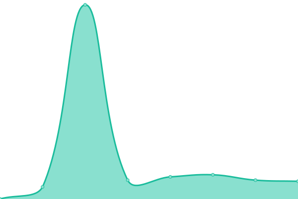 533ms
     
 | 

<a href="https://jgui1129.github.io/UTD-Sites-Status-Checker/history/sportcoop">100.00%</a>
    

|  [Stado](https://www.stado.be) | 🟩 Up | [stado.yml](https://github.com/jgui1129/UTD-Sites-Status-Checker/commits/HEAD/history/stado.yml) | 

 497ms
     
 | 

<a href="https://jgui1129.github.io/UTD-Sites-Status-Checker/history/stado">100.00%</a>
    

|  [Stageplan](https://www.stageplan.be) | 🟩 Up | [stageplan.yml](https://github.com/jgui1129/UTD-Sites-Status-Checker/commits/HEAD/history/stageplan.yml) | 

 803ms
     
 | 

<a href="https://jgui1129.github.io/UTD-Sites-Status-Checker/history/stageplan">100.00%</a>
    

|  [Stappers](https://blog.advocatenkantoorstappers.be) | 🟩 Up | [stappers.yml](https://github.com/jgui1129/UTD-Sites-Status-Checker/commits/HEAD/history/stappers.yml) | 

 781ms
     
 | 

<a href="https://jgui1129.github.io/UTD-Sites-Status-Checker/history/stappers">100.00%</a>
    

|  [Stappers Advocantenkantoor](https://www.stappersadvocatenkantoor.be) | 🟩 Up | [stappers-advocantenkantoor.yml](https://github.com/jgui1129/UTD-Sites-Status-Checker/commits/HEAD/history/stappers-advocantenkantoor.yml) | 

 233ms
     
 | 

<a href="https://jgui1129.github.io/UTD-Sites-Status-Checker/history/stappers-advocantenkantoor">100.00%</a>
    

|  [Studio Slimm](https://www.studioslimm.be) | 🟩 Up | [studio-slimm.yml](https://github.com/jgui1129/UTD-Sites-Status-Checker/commits/HEAD/history/studio-slimm.yml) | 

 543ms
     
 | 

<a href="https://jgui1129.github.io/UTD-Sites-Status-Checker/history/studio-slimm">99.41%</a>
    

|  [Svalco](https://www.svalco.be) | 🟩 Up | [svalco.yml](https://github.com/jgui1129/UTD-Sites-Status-Checker/commits/HEAD/history/svalco.yml) | 

 442ms
     
 | 

<a href="https://jgui1129.github.io/UTD-Sites-Status-Checker/history/svalco">100.00%</a>
    

|  [SVG Construct](https://www.svg-construct.be) | 🟩 Up | [svg-construct.yml](https://github.com/jgui1129/UTD-Sites-Status-Checker/commits/HEAD/history/svg-construct.yml) | 

 489ms
     
 | 

<a href="https://jgui1129.github.io/UTD-Sites-Status-Checker/history/svg-construct">100.00%</a>
    

|  [Syndicus Hasselt](https://www.syndicushasselt.be) | 🟩 Up | [syndicus-hasselt.yml](https://github.com/jgui1129/UTD-Sites-Status-Checker/commits/HEAD/history/syndicus-hasselt.yml) | 

 482ms
     
 | 

<a href="https://jgui1129.github.io/UTD-Sites-Status-Checker/history/syndicus-hasselt">100.00%</a>
    

|  [TAE Blog FR](https://actua.tae.be) | 🟩 Up | [tae-blog-fr.yml](https://github.com/jgui1129/UTD-Sites-Status-Checker/commits/HEAD/history/tae-blog-fr.yml) | 

 517ms
     
 | 

<a href="https://jgui1129.github.io/UTD-Sites-Status-Checker/history/tae-blog-fr">100.00%</a>
    

|  [TAE Blog NL](https://blog.tae.be) | 🟩 Up | [tae-blog-nl.yml](https://github.com/jgui1129/UTD-Sites-Status-Checker/commits/HEAD/history/tae-blog-nl.yml) | 

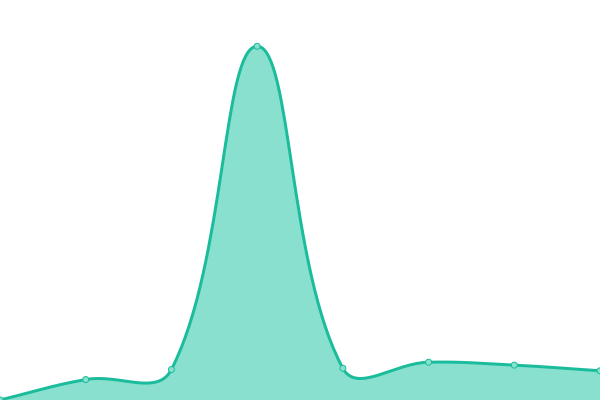 1315ms
     
 | 

<a href="https://jgui1129.github.io/UTD-Sites-Status-Checker/history/tae-blog-nl">100.00%</a>
    

|  [Tax Service](https://www.taxservice-euregio.nl) | 🟩 Up | [tax-service.yml](https://github.com/jgui1129/UTD-Sites-Status-Checker/commits/HEAD/history/tax-service.yml) | 

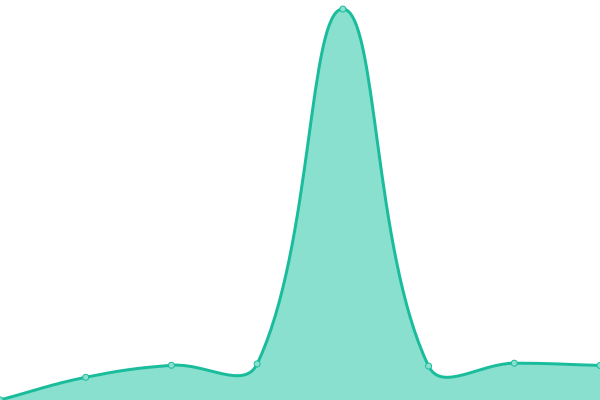 466ms
     
 | 

<a href="https://jgui1129.github.io/UTD-Sites-Status-Checker/history/tax-service">100.00%</a>
    

|  [Terramax](https://www.terramax.be) | 🟩 Up | [terramax.yml](https://github.com/jgui1129/UTD-Sites-Status-Checker/commits/HEAD/history/terramax.yml) | 

 511ms
     
 | 

<a href="https://jgui1129.github.io/UTD-Sites-Status-Checker/history/terramax">100.00%</a>
    

|  [Tervado](https://www.tervado.be) | 🟥 Down | [tervado.yml](https://github.com/jgui1129/UTD-Sites-Status-Checker/commits/HEAD/history/tervado.yml) | 

 529ms
     
 | 

<a href="https://jgui1129.github.io/UTD-Sites-Status-Checker/history/tervado">99.96%</a>
    

|  [Thoxa](https://www.thoxa.be) | 🟩 Up | [thoxa.yml](https://github.com/jgui1129/UTD-Sites-Status-Checker/commits/HEAD/history/thoxa.yml) | 

 569ms
     
 | 

<a href="https://jgui1129.github.io/UTD-Sites-Status-Checker/history/thoxa">100.00%</a>
    

|  [Thuisverpleging Eva Bosman](https://www.evabosmanthuisverpleging.be) | 🟩 Up | [thuisverpleging-eva-bosman.yml](https://github.com/jgui1129/UTD-Sites-Status-Checker/commits/HEAD/history/thuisverpleging-eva-bosman.yml) | 

 463ms
     
 | 

<a href="https://jgui1129.github.io/UTD-Sites-Status-Checker/history/thuisverpleging-eva-bosman">100.00%</a>
    

|  [Toon Kamer](https://www.detoonkamer.be) | 🟩 Up | [toon-kamer.yml](https://github.com/jgui1129/UTD-Sites-Status-Checker/commits/HEAD/history/toon-kamer.yml) | 

 497ms
     
 | 

<a href="https://jgui1129.github.io/UTD-Sites-Status-Checker/history/toon-kamer">100.00%</a>
    

|  [Total Energy](https://www.totalenergy.be) | 🟩 Up | [total-energy.yml](https://github.com/jgui1129/UTD-Sites-Status-Checker/commits/HEAD/history/total-energy.yml) | 

 484ms
     
 | 

<a href="https://jgui1129.github.io/UTD-Sites-Status-Checker/history/total-energy">100.00%</a>
    

|  [TR Engineering](https://www.tr-engineering.be) | 🟩 Up | [tr-engineering.yml](https://github.com/jgui1129/UTD-Sites-Status-Checker/commits/HEAD/history/tr-engineering.yml) | 

 610ms
     
 | 

<a href="https://jgui1129.github.io/UTD-Sites-Status-Checker/history/tr-engineering">100.00%</a>
    

|  [Tuinen Sannen](https://www.tuinensannen.be) | 🟩 Up | [tuinen-sannen.yml](https://github.com/jgui1129/UTD-Sites-Status-Checker/commits/HEAD/history/tuinen-sannen.yml) | 

 488ms
     
 | 

<a href="https://jgui1129.github.io/UTD-Sites-Status-Checker/history/tuinen-sannen">100.00%</a>
    

|  [Tuinwerken Harings](https://www.tuinwerken-harings.be) | 🟩 Up | [tuinwerken-harings.yml](https://github.com/jgui1129/UTD-Sites-Status-Checker/commits/HEAD/history/tuinwerken-harings.yml) | 

 442ms
     
 | 

<a href="https://jgui1129.github.io/UTD-Sites-Status-Checker/history/tuinwerken-harings">100.00%</a>
    

|  [Ufficio](https://ufficio2en.blogspot.com) | 🟥 Down | [ufficio.yml](https://github.com/jgui1129/UTD-Sites-Status-Checker/commits/HEAD/history/ufficio.yml) | 

 2051ms
     
 | 

<a href="https://jgui1129.github.io/UTD-Sites-Status-Checker/history/ufficio">97.90%</a>
    

|  [UP-TO-DATE Communication](https://www.uptodatecommunication.be) | 🟩 Up | [up-to-date-communication.yml](https://github.com/jgui1129/UTD-Sites-Status-Checker/commits/HEAD/history/up-to-date-communication.yml) | 

 453ms
     
 | 

<a href="https://jgui1129.github.io/UTD-Sites-Status-Checker/history/up-to-date-communication">100.00%</a>
    

|  [UP-TO-DATE My Business](https://www.uptodatemybusiness.be) | 🟩 Up | [up-to-date-my-business.yml](https://github.com/jgui1129/UTD-Sites-Status-Checker/commits/HEAD/history/up-to-date-my-business.yml) | 

 511ms
     
 | 

<a href="https://jgui1129.github.io/UTD-Sites-Status-Checker/history/up-to-date-my-business">100.00%</a>
    

|  [UP-TO-DATE Smart Blog](https://www.uptodatesmartblog.be) | 🟩 Up | [up-to-date-smart-blog.yml](https://github.com/jgui1129/UTD-Sites-Status-Checker/commits/HEAD/history/up-to-date-smart-blog.yml) | 

 480ms
     
 | 

<a href="https://jgui1129.github.io/UTD-Sites-Status-Checker/history/up-to-date-smart-blog">100.00%</a>
    

|  [UP-TO-DATE Smart Site](https://www.uptodatesmartsite.be) | 🟩 Up | [up-to-date-smart-site.yml](https://github.com/jgui1129/UTD-Sites-Status-Checker/commits/HEAD/history/up-to-date-smart-site.yml) | 

 273ms
     
 | 

<a href="https://jgui1129.github.io/UTD-Sites-Status-Checker/history/up-to-date-smart-site">100.00%</a>
    

|  [UP-TO-DATE WebDesign](https://www.uptodatewebdesign.com) | 🟩 Up | [up-to-date-web-design.yml](https://github.com/jgui1129/UTD-Sites-Status-Checker/commits/HEAD/history/up-to-date-web-design.yml) | 

 319ms
     
 | 

<a href="https://jgui1129.github.io/UTD-Sites-Status-Checker/history/up-to-date-web-design">100.00%</a>
    

|  [Vantamoon](https://www.vantamoon.com) | 🟩 Up | [vantamoon.yml](https://github.com/jgui1129/UTD-Sites-Status-Checker/commits/HEAD/history/vantamoon.yml) | 

 571ms
     
 | 

<a href="https://jgui1129.github.io/UTD-Sites-Status-Checker/history/vantamoon">100.00%</a>
    

|  [Venditio +](https://www.venditioplus.be) | 🟩 Up | [venditio.yml](https://github.com/jgui1129/UTD-Sites-Status-Checker/commits/HEAD/history/venditio.yml) | 

 677ms
     
 | 

<a href="https://jgui1129.github.io/UTD-Sites-Status-Checker/history/venditio">100.00%</a>
    

|  [Verkoop Anders](https://www.verkoopanders.be) | 🟩 Up | [verkoop-anders.yml](https://github.com/jgui1129/UTD-Sites-Status-Checker/commits/HEAD/history/verkoop-anders.yml) | 

 490ms
     
 | 

<a href="https://jgui1129.github.io/UTD-Sites-Status-Checker/history/verkoop-anders">100.00%</a>
    

|  [Vived Management](https://www.vived-management.be) | 🟩 Up | [vived-management.yml](https://github.com/jgui1129/UTD-Sites-Status-Checker/commits/HEAD/history/vived-management.yml) | 

 452ms
     
 | 

<a href="https://jgui1129.github.io/UTD-Sites-Status-Checker/history/vived-management">100.00%</a>
    

|  [Volvo Jacobs Genk](https://www.volvojacobs.be) | 🟥 Down | [volvo-jacobs-genk.yml](https://github.com/jgui1129/UTD-Sites-Status-Checker/commits/HEAD/history/volvo-jacobs-genk.yml) | 

 597ms
     
 | 

<a href="https://jgui1129.github.io/UTD-Sites-Status-Checker/history/volvo-jacobs-genk">99.96%</a>
    

|  [Waw Jobs](https://blog.waw.jobs) | 🟩 Up | [waw-jobs.yml](https://github.com/jgui1129/UTD-Sites-Status-Checker/commits/HEAD/history/waw-jobs.yml) | 

 534ms
     
 | 

<a href="https://jgui1129.github.io/UTD-Sites-Status-Checker/history/waw-jobs">100.00%</a>
    

|  [Windex Lanaken](https://www.windexlanaken.be) | 🟩 Up | [windex-lanaken.yml](https://github.com/jgui1129/UTD-Sites-Status-Checker/commits/HEAD/history/windex-lanaken.yml) | 

 599ms
     
 | 

<a href="https://jgui1129.github.io/UTD-Sites-Status-Checker/history/windex-lanaken">100.00%</a>
    

|  [WLH](https://www.wlh.be) | 🟩 Up | [wlh.yml](https://github.com/jgui1129/UTD-Sites-Status-Checker/commits/HEAD/history/wlh.yml) | 

 645ms
     
 | 

<a href="https://jgui1129.github.io/UTD-Sites-Status-Checker/history/wlh">100.00%</a>
    

|  [Xenadvies](https://blog.xenadvies.be) | 🟩 Up | [xenadvies.yml](https://github.com/jgui1129/UTD-Sites-Status-Checker/commits/HEAD/history/xenadvies.yml) | 

 457ms
     
 | 

<a href="https://jgui1129.github.io/UTD-Sites-Status-Checker/history/xenadvies">100.00%</a>
    

|  [Zone Affligem](https://www.zone-affligem.be) | 🟥 Down | [zone-affligem.yml](https://github.com/jgui1129/UTD-Sites-Status-Checker/commits/HEAD/history/zone-affligem.yml) | 

 0ms
     
 | 

<a href="https://jgui1129.github.io/UTD-Sites-Status-Checker/history/zone-affligem">0.00%</a>
    

|  [Zone Beringen](https://www.zone-beringen.be) | 🟩 Up | [zone-beringen.yml](https://github.com/jgui1129/UTD-Sites-Status-Checker/commits/HEAD/history/zone-beringen.yml) | 

 494ms
     
 | 

<a href="https://jgui1129.github.io/UTD-Sites-Status-Checker/history/zone-beringen">100.00%</a>
    

|  [Zone Dilbeek](https://www.zone-dilbeek.be) | 🟩 Up | [zone-dilbeek.yml](https://github.com/jgui1129/UTD-Sites-Status-Checker/commits/HEAD/history/zone-dilbeek.yml) | 

 325ms
     
 | 

<a href="https://jgui1129.github.io/UTD-Sites-Status-Checker/history/zone-dilbeek">100.00%</a>
    

|  [Zone Houthalen](https://www.zone-houthalen-helchteren.be) | 🟩 Up | [zone-houthalen.yml](https://github.com/jgui1129/UTD-Sites-Status-Checker/commits/HEAD/history/zone-houthalen.yml) | 

 1002ms
     
 | 

<a href="https://jgui1129.github.io/UTD-Sites-Status-Checker/history/zone-houthalen">100.00%</a>
    

|  [Zone Mechelen Zuid](https://www.zone-mechelen-zuid.be) | 🟥 Down | [zone-mechelen-zuid.yml](https://github.com/jgui1129/UTD-Sites-Status-Checker/commits/HEAD/history/zone-mechelen-zuid.yml) | 

 0ms
     
 | 

<a href="https://jgui1129.github.io/UTD-Sites-Status-Checker/history/zone-mechelen-zuid">0.00%</a>
    

|  [Zone Roeselare](https://www.zone-roeselare.be) | 🟥 Down | [zone-roeselare.yml](https://github.com/jgui1129/UTD-Sites-Status-Checker/commits/HEAD/history/zone-roeselare.yml) | 

 0ms
     
 | 

<a href="https://jgui1129.github.io/UTD-Sites-Status-Checker/history/zone-roeselare">0.00%</a>
    

|  [Zwembaddokter](https://www.zwembaddokter.be) | 🟩 Up | [zwembaddokter.yml](https://github.com/jgui1129/UTD-Sites-Status-Checker/commits/HEAD/history/zwembaddokter.yml) | 

 463ms
     
 | 

<a href="https://jgui1129.github.io/UTD-Sites-Status-Checker/history/zwembaddokter">100.00%</a>
    

|  [ZZIN Coaching](https://www.zzin.nl) | 🟩 Up | [zzin-coaching.yml](https://github.com/jgui1129/UTD-Sites-Status-Checker/commits/HEAD/history/zzin-coaching.yml) | 

 441ms
     
 | 

<a href="https://jgui1129.github.io/UTD-Sites-Status-Checker/history/zzin-coaching">100.00%</a>
    

<!--end: status pages-->

[**Visit our status website →**](https://demo.upptime.js.org)

## 📄 License

- Powered by: [Upptime](https://github.com/upptime/upptime)
- Code: [MIT](./LICENSE) © [Jeric Guillermo](uptodatewebdesign.be)
- Data in the `./history` directory: [Open Database License](https://opendatacommons.org/licenses/odbl/1-0/)
